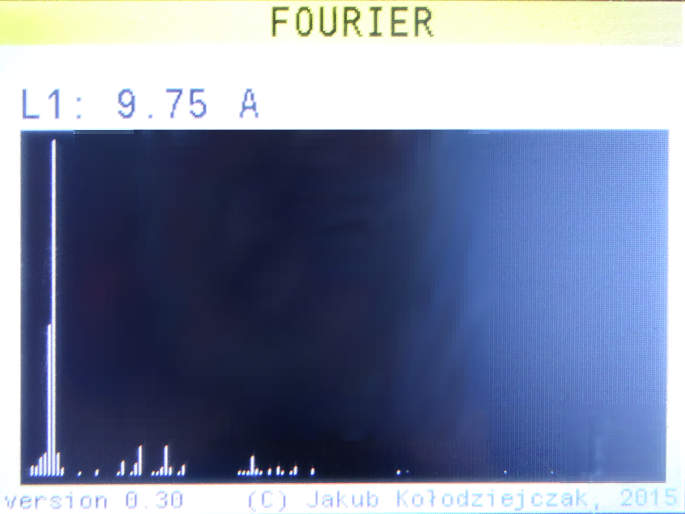
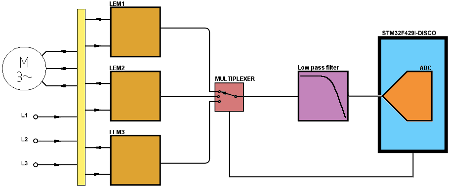
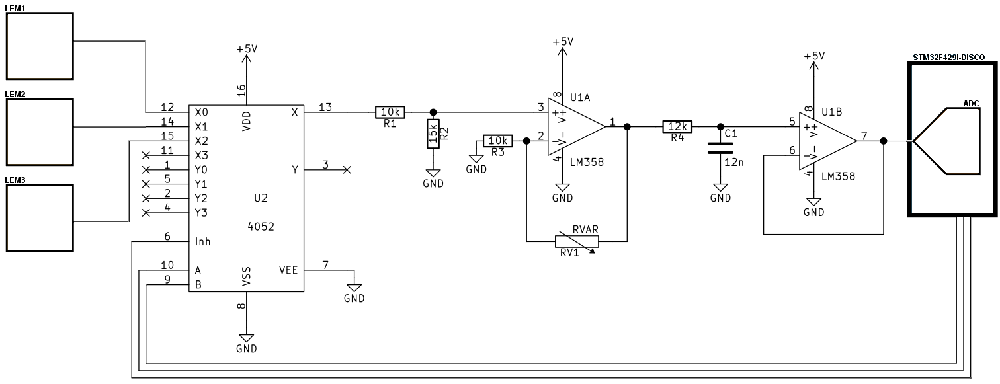
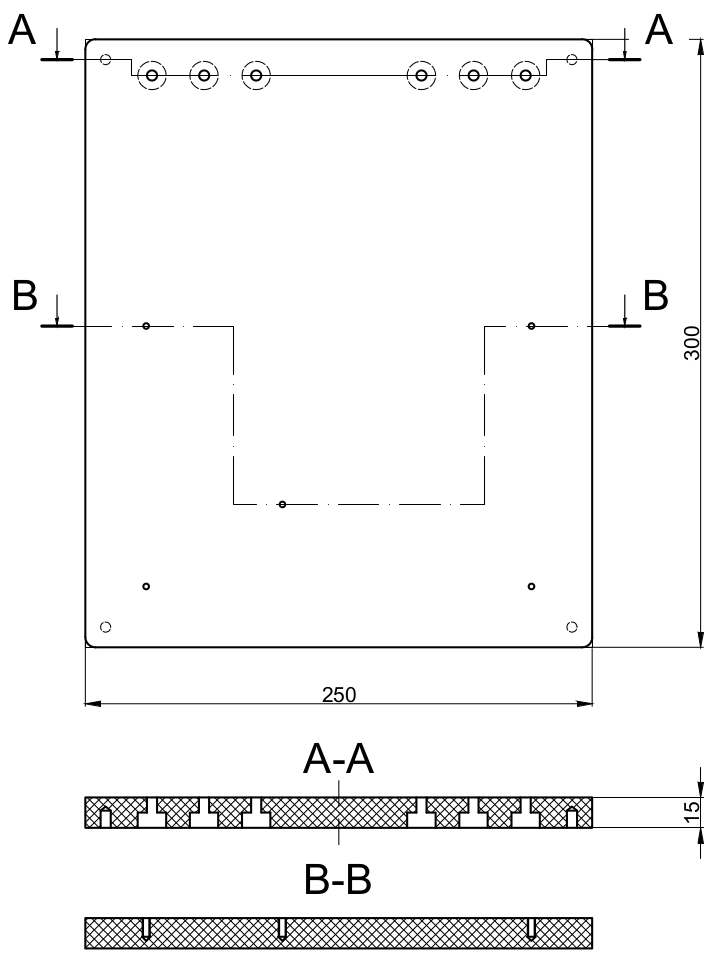
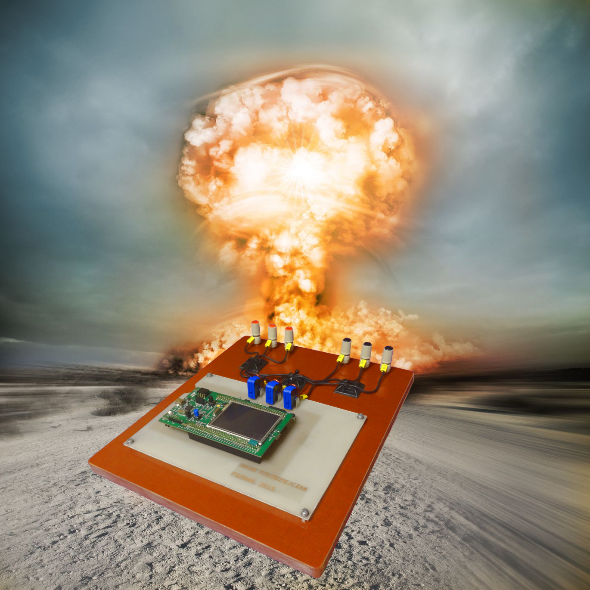
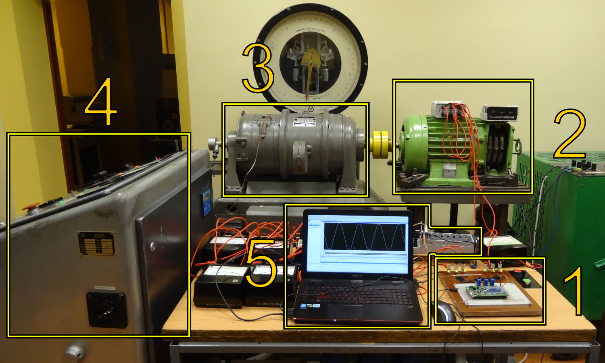

# FOURIER

This is a software part of my engineering thesis. I started working on it in
the middle of December 2015. Later I defended my engineering thesis somewhere
on March 2016 with final grade of good plus.

This software basically:
1. Computes [discrete Fourier transform (aka
   DFT)](https://en.wikipedia.org/wiki/Discrete_Fourier_transform) of input
   signal by using [fast Fourier transform (aka
   FFT)](https://en.wikipedia.org/wiki/Fast_Fourier_transform) algorithm
2. Computes [root mean square (aka
   RMS)](https://en.wikipedia.org/wiki/Root_mean_square) of input signal
3. Displays [frequency domain](https://en.wikipedia.org/wiki/Frequency_domain)
   of input signal

ALL IN REAL TIME!

Here special thanks MUST go to [Tilen Majerle](https://github.com/MaJerle).
I used his libs and also was peeking at his code to make my `FOURIER` working
on `STM32F429I-DISCO`!

## Most notable input signals processed by this software

This software was battle tested with i.a.:
1. [main theme](https://www.youtube.com/watch?v=h1PfrmCGFnk) of ["The Good the
   Bad and the Ugly"
   movie](https://en.wikipedia.org/wiki/The_Good,_the_Bad_and_the_Ugly) by
   [Ennio Morricone](https://en.wikipedia.org/wiki/Ennio_Morricone)
2. 3,3 kW three phase induction motor

## Few more words about my engineering thesis

*Subject:* Project of monitoring system of electric drive using microcontroller
STM32F429I-DISCO

*Abstract:* The thesis deals with diagnostics and monitoring of electric drive.
A description of designed and built electric drive monitoring system is
presented. Line currents are measured by three Hall effect transducers. The
microcontroller's software processes an input signal and displays results on
the controller's LCD screen. The designed system's functioning is verified by a
professional diagnostic system. A review of induction motor diagnostic methods
and monitoring systems is given as well.

